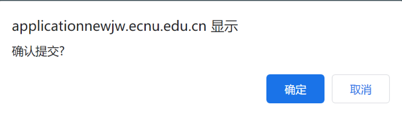
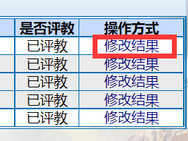
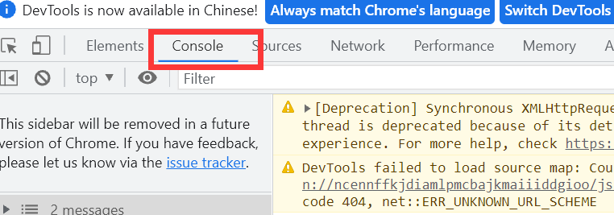

# :dog:ECNU-AutoEvaluation
> ECNU自动评教脚本
>
> 创意来源于https://github.com/Gun9niR/Auto-Grade


## :koala:说明

- 暂时只支持单步进入的单个评教

- 无法自动点击确认
- 如果你有额外的想法，欢迎提交PR:smiley:

  

## :wolf:步骤

### 第一步

进入你的学生评价页面，正常情况下应显示未评教，单步进入



### 第二步

复制如下代码

```javascript
var unEvaluated;
var numOfUnEvaluated = $('.gridtable tr:contains("未评教")').length;
console.log(numOfUnEvaluated)

function autoEvaluateSingle() {
    setRadioBox();
    writeEvaluation();
    setTimeout(function(){
        $('#btnSave').click();
    }, 1000);
}

function setRadioBox(params) {
    $(".gridtable input[value=4]").attr("checked",true); // for previous six box
    $("#op_135_133").attr("checked",true); // for the last one (although i do not know why)
}

function writeEvaluation() {
    writeForFirst();
    writeForSecond();
    writeForThird();
}

function writeForFirst() {
    const val = "教师上课内容翔实，认真负责，课程难度适中，为我们开拓了全新视野。";
    $('textarea[name="textEvaluateQuestion1"]').val(val)
}

function writeForSecond() {
    const val = "课程设置较为合理，暂时没有值得改进的地方。";
    $("textarea[name='textEvaluateQuestion2']").val(val);
}

function writeForThird() {
    const val = "好好学习，认真听讲。";
    $("textarea[name='textEvaluateQuestion3']").val(val);
}

function main() {
    autoEvaluateSingle()
}

main();
```

### 第三步

在你评教界面的浏览器，Win：按F12，Mac：按住Fn才会出现F12

### 第四步

点击Console，复制粘贴如上代码，回车确认，即可完成评教


